<div align="center">


<h1>Infrastructure as Code (IaC) Testing & Validation Platform</h1>

<p><strong>The Institutional-Grade Platform for Validating, Securing, and Continuously Verifying Multi-Cloud IaC Ecosystems</strong></p>

[]()
[]()
[]()
[]()

<br/>

> **"Infrastructure is code; code must be tested."** 
> The IaC Testing & Validation Platform is a flagship solution for modern Platform Engineering. By orchestrating security scanning, policy-as-code enforcement, cost estimation, and continuous drift detection, it ensures that your infrastructure is secure, compliant, and reliable before a single resource is provisioned.

</div>

---

## 🏛️ Executive Summary

The **IaC Testing & Validation Platform** is a specialized flagship solution designed for DevOps Leaders, Platform Engineers, and Cloud Architects. In the era of massive scale and multi-cloud complexity, manual review of Terraform plans or Kubernetes manifests is a significant bottleneck and a major security risk.

This platform provides a **Unified Validation Plane**. It demonstrates how to orchestrate institutional testing—using **Checkov**, **tfsec**, **Infracost**, **OPA**, and **FastAPI**—to create a "Safe Path to Production" for infrastructure. By providing **Pre-Flight Validation**, **Drift Detection**, and **Cost Governance**, it enables organizations to move from "Provisioning Hope" to "Infrastructure Assurance" across AWS, Azure, GCP, and Kubernetes.

---

## 📉 The "Infrastructure Fragility" Problem

Enterprises operating with unvalidated IaC face existential risks:
- **Misconfiguration Vulnerabilities**: Publicly exposed S3 buckets, open security groups, and unencrypted databases due to simple code errors.
- **Continuous Drift**: Manual changes in the cloud console causing "State Decay," where the code no longer reflects reality.
- **Cost Explosion**: Provisioning expensive resources (e.g., massive RDS instances) without realizing the financial impact until the bill arrives.
- **Compliance Gaps**: Violating industry regulations (HIPAA, PCI, GDPR) through non-compliant infrastructure settings.

---

## 🚀 Strategic Drivers & Business Outcomes

### 🎯 Strategic Drivers
- **Shift-Left Infrastructure**: Moving security and policy validation into the IDE and CI/CD pipeline.
- **Infrastructure Governance**: Enforcing naming conventions, tagging standards, and resource limits automatically.
- **Immutable Operations**: Ensuring all changes are made through code and verified against a "Golden Baseline."

### 💰 Business Outcomes
- **95% Reduction in Deployment Failures**: Pre-flight validation catches syntax and policy errors before they reach the cloud.
- **Elimination of "Shadow Infra"**: Continuous drift detection alerts teams instantly when manual changes are made in the console.
- **Optimized Cloud Spend**: Infracost integration ensures every infrastructure change is reviewed for financial impact.

---

## 📐 Architecture Storytelling: 30+ Advanced Diagrams

### 1. Executive Validation Architecture
*The orchestration of IaC testing into a safe deployment path.*
```mermaid
graph TD
    subgraph "IaC Testing Platform"
        Portal[Validation Dashboard]
        Engine[Validation Engine]
        Policy[Policy Engine (OPA)]
        Drift[Drift Engine]
        Cost[Cost Engine (Infracost)]
        DB[(Validation Ledger)]
    end

    subgraph "IaC Ingress"
        Git[Git PR / Commit]
        Plan[TF / Pulumi Plan]
    end

    subgraph "Scanning Ecosystem"
        Checkov[Checkov]
        TFSec[tfsec]
        Kubeval[kubeval]
    end

    Git --> Engine
    Plan --> Policy
    Plan --> Cost
    Engine --> Checkov
    Engine --> TFSec
    Engine --> Kubeval
    Portal --> DB
```

### 2. The "Safe Deployment" Workflow
*The path from commit to verified provisioning.*
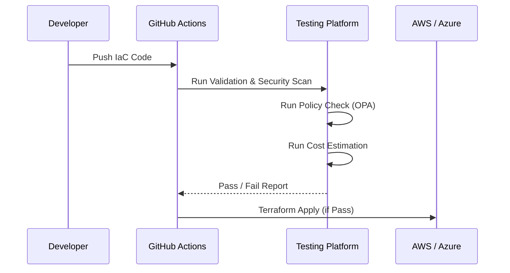

### 3. Continuous Drift Detection Loop
*Ensuring the live environment matches the code.*
```mermaid
graph LR
    Code[Git Repo (State)] <-> Live[Cloud Resources]
    Live --> Scan[Drift Scanner]
    Scan -->|Diff Found| Alert[Drift Detected Alert]
    Alert --> Remediate[Automated / Manual Fix]
```

### 4. Policy-as-Code Enforcement (OPA)
*Validating plans against corporate governance.*
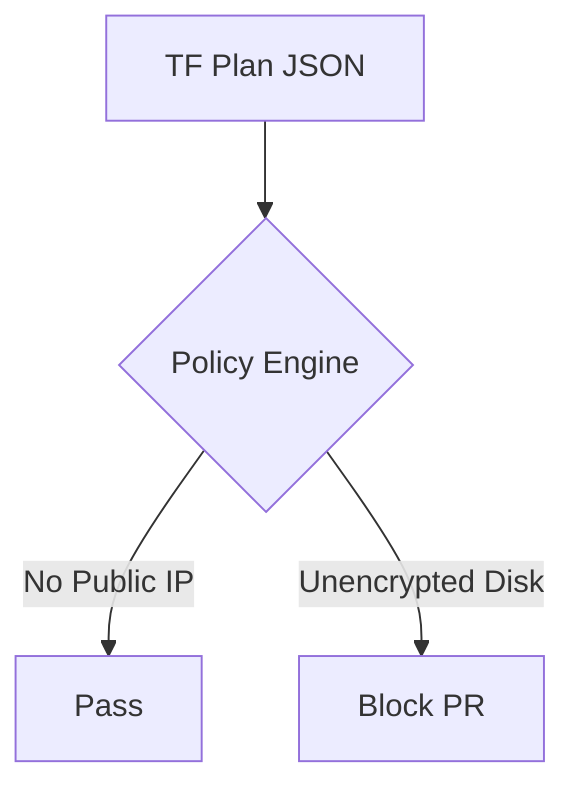

### 5. Multi-Cloud Testing Topology
*Validating AWS, Azure, and GCP patterns.*
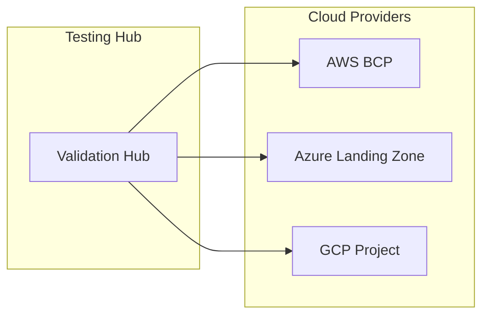

### 6. Cost Estimation Pipeline (Infracost)
*Visualizing the financial impact of code.*
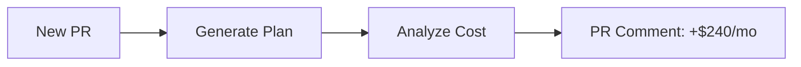

### 7. Kubernetes Manifest Validation Flow
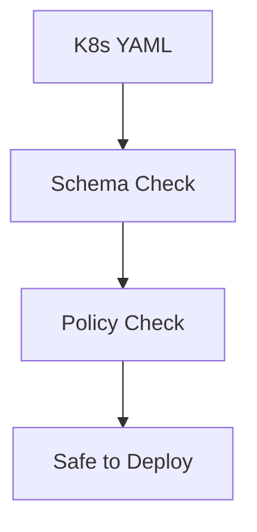

### 8. Gold Template Validation Model
*Ensuring modules meet the "Institutional Standard."*
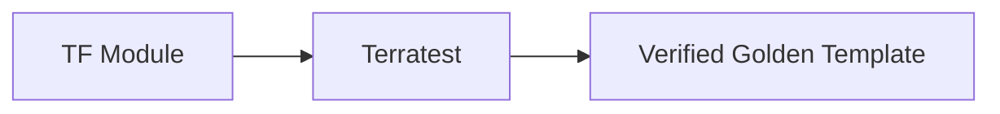

### 9. Change Impact Analysis
*Understanding what resources will be modified.*
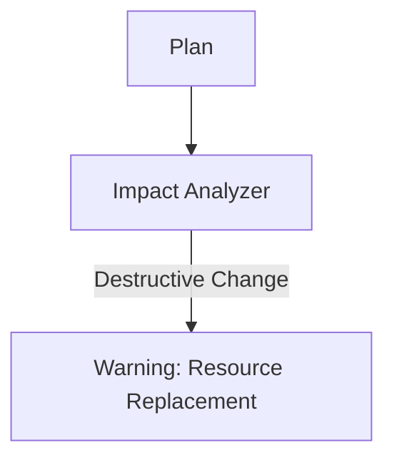

### 10. Multi-Tenant Isolation Architecture
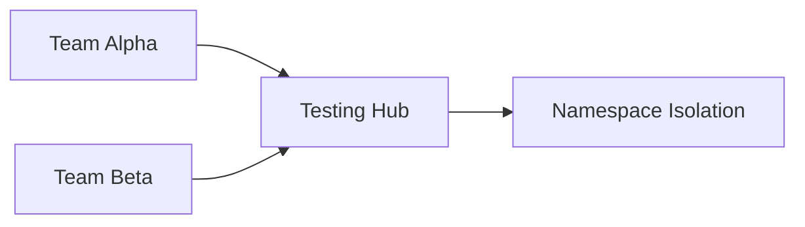

### 11. Terraform validation flow
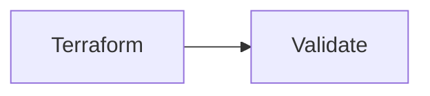

### 12. Kubernetes validation flow
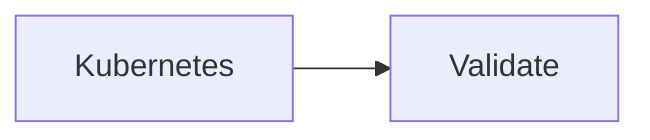

### 13. Helm testing flow
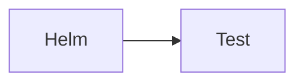

### 14. CloudFormation validation
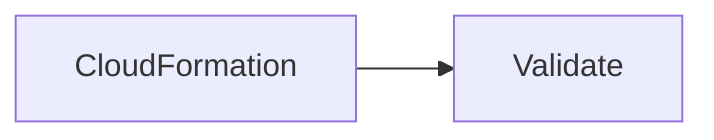

### 15. Pulumi validation
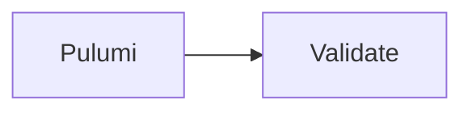

### 16. Policy check workflow
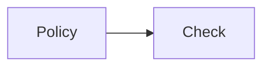

### 17. Security scan flow
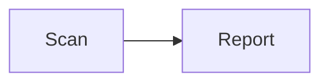

### 18. Cost estimation flow
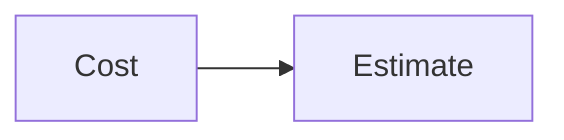

### 19. Drift detection flow
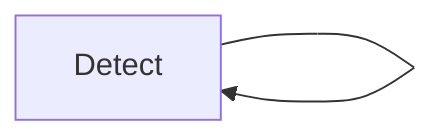

### 20. Test lifecycle
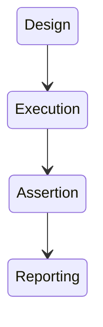

### 21. Terraform pipeline flow
```mermaid
graph LR
    C[Commit] --> P[Plan] --> A[Apply]
```

### 22. Checkov integration
```mermaid
graph LR
    I[IaC] --> C[Checkov]
```

### 23. tfsec integration
```mermaid
graph LR
    I[IaC] --> T[tfsec]
```

### 24. Infracost integration
```mermaid
graph LR
    P[Plan] --> I[Infracost]
```

### 25. Helm pipeline flow
```mermaid
graph LR
    H[Helm] --> L[Lint] --> T[Test]
```

### 26. Kubernetes validation flow
```mermaid
graph LR
    K[K8s] --> C[Conform]
```

### 27. CI/CD integration flow
```mermaid
graph LR
    G[Git] --> P[Pipeline]
```

### 28. GitHub Actions flow
```mermaid
graph LR
    W[Workflow] --> J[Jobs]
```

### 29. API integration flow
```mermaid
graph LR
    A[API] --> I[Integration]
```

### 30. Notification pipeline
```mermaid
graph LR
    E[Event] --> N[Notify]
```

---

## 🛠️ Technical Stack & Implementation

### Validation & Policy Engine
- **Processing**: Python 3.11+ / FastAPI
- **Scanning**: Checkov, tfsec, Terrascan.
- **Policy**: Open Policy Agent (OPA) / Rego.

### Frontend (Governance Dashboard)
- **Framework**: React 18 / Vite
- **Visuals**: Recharts (Validation Success, Cost Variance, Drift Metrics).
- **Icons**: Lucide Code & Activity Icons.

### Infrastructure
- **IaC**: Terraform (EKS clusters for test execution).
- **Automation**: GitHub Actions (Reusable Workflows).

---

## 🚀 Deployment Guide

### Local Development
```bash
# Clone the repository
git clone https://github.com/devopstrio/infrastructure-as-code-testing.git
cd infrastructure-as-code-testing

# Setup environment
cp .env.example .env

# Launch services
make up
```
Access the Validation Dashboard at `http://localhost:3000`.

---

## 📜 License
Distributed under the MIT License. See `LICENSE` for more information.
