<div align="center">


<h1>IaC Testing & Validation</h1>

<p><strong>The Institutional-Grade Platform for Validating, Securing, and Continuously Verifying Multi-Cloud IaC Ecosystems.</strong></p>

[]()
[]()
[]()

<br/>

> **"Infrastructure is code; code must be tested."** 
> **IaC Testing & Validation** is an enterprise-grade platform designed to provide a secure, measurable, and highly automated foundation for global infrastructure operations. It orchestrates the complex lifecycle of infrastructure testing—from "Shift-Left" static analysis and multi-cloud integration testing to ephemeral test environment orchestration and unified quality governance.

</div>

---

## 🏛️ Executive Summary

Fragmented infrastructure code and manual deployment validation processes are strategic operational liabilities; lack of centralized IaC testing orchestration is a primary barrier to organizational infrastructure agility. Organizations fail to maintain deployment reliability not because of a lack of tools, but because of fragmented testing standards, lack of automated policy validation, and an inability to orchestrate IaC testing landing zones with operational precision.

This platform provides the **Testing Intelligence Plane**. It implements a complete **Enterprise Testing-as-Code Framework**, enabling DevOps and Platform teams to manage global infrastructure quality as first-class citizens. By automating the identification of misconfigurations through real-time static analysis and orchestrating the provisioning of ephemeral test beds, we ensure that every organizational asset—from core network modules to application-specific microservice configs—is verified by default, audited for history, and strictly aligned with institutional testing frameworks.

---

## 📐 Architecture Storytelling: Principal Reference Models

### 1. Principal Architecture: Global IaC Testing & Validation Intelligence Plane
This diagram illustrates the end-to-end flow from infrastructure code commit and static analysis to integration testing, ephemeral environment orchestration, and institutional quality auditing.

```mermaid
graph LR
    %% Subgraph Definitions
    subgraph TestingIngress["Infrastructure Code & Plan Ingress"]
        direction TB
        TF_Bicep_Code["Terraform / Bicep Source"]
        CloudPlans["TF Plans / ARM Blueprints"]
        K8sManifests["K8s / Helm Manifests"]
    end

    subgraph IntelligenceEngine["Testing Intelligence Hub"]
        direction TB
        API["FastAPI Testing Gateway"]
        StaticAnalyzer["Shift-Left Static Scanner"]
        EphemeralOrch["Ephemeral Env Orchestrator"]
        IntegrationRunner["Integration & E2E Runner"]
    end

    subgraph OperationsPlane["Distributed Testing Fleet"]
        direction TB
        PolicyValidators["OPA / Checkov Rule Bots"]
        VerificationNodes["Post-Deploy Health Checkers"]
        DriftDetectors["Deployment Drift Scanners"]
    end

    subgraph OperationsHub["Institutional Testing Hub"]
        direction TB
        Scorecard["IaC Quality Maturity Score"]
        Analytics["Test Coverage & Result Stats"]
        Audit["Forensic IaC Metadata Lake"]
    end

    subgraph DevOps["Testing-as-Code Framework"]
        direction TB
        TF["Terraform Testing Modules"]
        AnomalyBot["Deployment Anomaly Validator"]
        ChatOps["Test Approval Hub"]
    end

    %% Flow Arrows
    TestingIngress -->|1. Submit Code/Plan| API
    API -->|2. Run Static Scan| StaticAnalyzer
    StaticAnalyzer -->|3. Provision Test Bed| EphemeralOrch
    EphemeralOrch -->|4. Execute Integration| IntegrationRunner
    
    IntegrationRunner -->|5. Execute Validation| OperationsPlane
    OperationsPlane -->|6. Notify Results| ChatOps
    API -->|7. Visualize Quality| Scorecard
    
    Scorecard -->|8. Track Success| Analytics
    Scorecard -->|9. Record Findings| Audit
    
    TF -->|10. Provision Hub| IntelligenceEngine
    AnomalyBot -->|11. Inject Deployment Risk| StaticAnalyzer
    Audit -->|12. Improve Tests| PolicyValidators

    %% Styling
    classDef ingress fill:#f5f5f5,stroke:#616161,stroke-width:2px;
    classDef intel fill:#e8eaf6,stroke:#1a237e,stroke-width:2px;
    classDef operations fill:#e1f5fe,stroke:#01579b,stroke-width:2px;
    classDef ops fill:#ede7f6,stroke:#311b92,stroke-width:2px;
    classDef devops fill:#e8f5e9,stroke:#1b5e20,stroke-width:2px;

    class TestingIngress ingress;
    class IntelligenceEngine intel;
    class OperationsPlane operations;
    class OperationsHub ops;
    class DevOps devops;
```

### 2. The IaC Testing Lifecycle Flow
The continuous path of an infrastructure change from initial code commit and static analysis (lint/security) to active unit testing, integration (plan/apply), verification, and institutional forensic auditing.

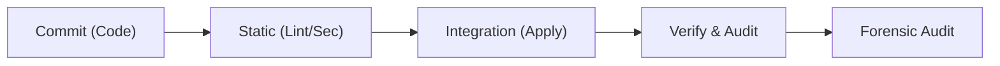

### 3. Distributed Testing Pipeline Topology
Strategically orchestrating infrastructure tests across multi-cloud environments (AWS, Azure, GCP), providing a unified institutional view of global infrastructure quality and deployment readiness.

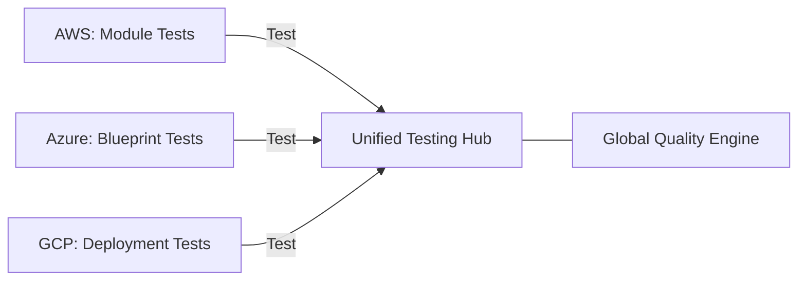

### 4. Static & Dynamic Policy Validation Flow
Executing complex logic for evaluating infrastructure-as-code against OPA, Checkov, and Terrascan rules, ensuring every organizational module is compliant and secure before deployment.

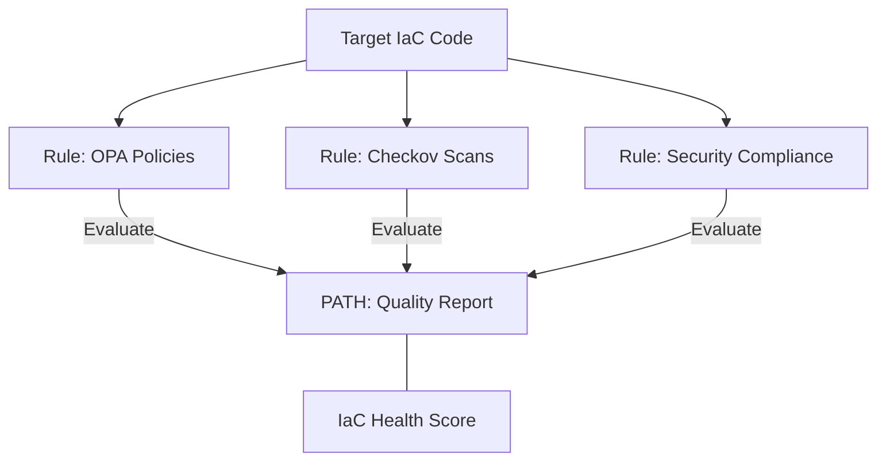

### 5. Ephemeral Environment Orchestration Flow
Automatically provisioning and de-provisioning temporary, isolated test beds for integration and end-to-end validation, ensuring zero-impact testing on production or shared environments.

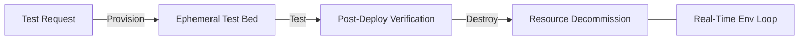

### 6. Institutional IaC Quality Maturity Scorecard
Grading organizational performance based on key indicators: Test Coverage Ratio, Deployment Success Rate, and Security Posture Index.

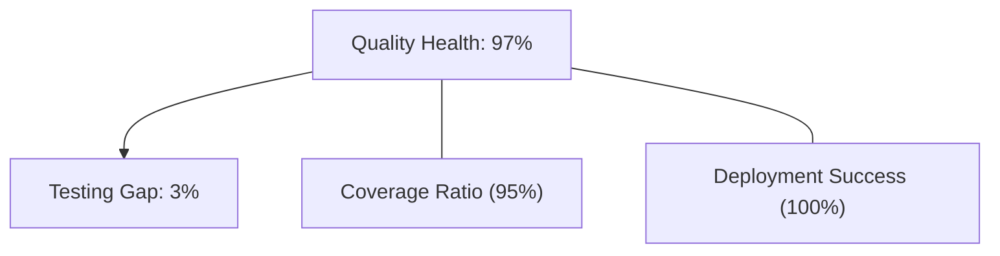

### 7. Identity & RBAC for IaC Testing Governance
Managing fine-grained access to testing schedules, environment triggers, and audit logs between QA Engineers, DevOps Engineers, and Security Auditors.

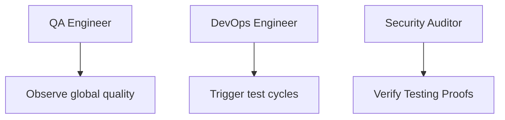

### 8. IaC Deployment: Testing-as-Code Framework
Using modular Terraform to deploy and manage the versioned distribution of the testing tracking hubs, validation workers, and forensic metadata lakes.

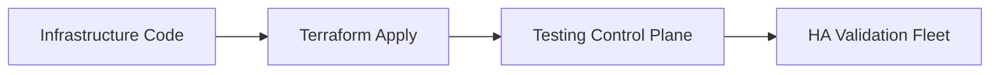

### 9. AIOps Deployment Anomaly & Drift Validation Flow
Using advanced analytics to identify sudden drops in infrastructure test quality, suspicious deployment patterns, or unusual resource drift that could result in institutional risk.

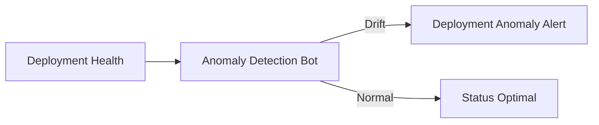

### 10. Metadata Lake for Forensic IaC Audit
Storing long-term records of every test run, every deployment result, and every policy override for institutional record-keeping, compliance auditing, and post-deployment forensics.

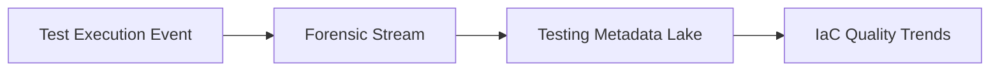

### 11. Continuous Verification & Post-Deploy Health Flow
Automatically ensuring that infrastructure remains healthy and compliant after the initial test/deploy phase through proactive health checking and continuous policy monitoring.

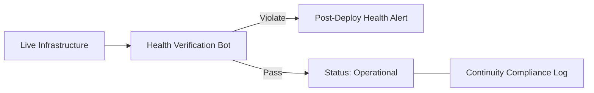

---

## 🏛️ Core Testing Pillars

1.  **Unified Quality Coordination**: Maximizing resilience by centralizing all infrastructure testing through a single institutional plane.
2.  **Automated Ephemeral Orchestration**: Eliminating "fragile environment" scenarios through proactive test bed provisioning and cleanup.
3.  **Sequential Validation Intelligence**: Ensuring zero-interruption deployments through dependency-aware multi-stage testing.
4.  **Zero-Trust Security Protection**: Automatically enforcing static analysis and policy scanning across all infrastructure code.
5.  **Autonomous Testing Logic**: Guaranteeing reliability through automated industry-specific verification runbooks.
6.  **Full Quality Auditability**: Immutable recording of every test run and deployment result for institutional forensics.

---

## 🛠️ Technical Stack & Implementation

### Testing Engine & APIs
*   **Framework**: Python 3.11+ / FastAPI.
*   **Scanning Hub**: Managed Checkov, tfsec, and OPA (Open Policy Agent) for rule evaluation.
*   **Orchestration Core**: Custom Python-based logic for ephemeral environment lifecycle management.
*   **Persistence**: PostgreSQL (Testing Ledger) and Redis (Live Job State).
*   **Auth Orchestrator**: Federated OIDC/SAML for least-privilege testing management access.

### Governance Dashboard (UI)
*   **Framework**: React 18 / Vite.
*   **Theme**: Dark, Indigo, Slate (Modern high-fidelity testing aesthetic).
*   **Visualization**: D3.js for pipeline topologies and Recharts for quality velocity analytics.

### Infrastructure & DevOps
*   **Runtime**: AWS EKS or Azure Kubernetes Service (AKS) for management plane.
*   **Pipeline Hub**: Managed CI/CD using GitHub Actions and GitLab Runner.
*   **IaC**: Modular Terraform for deploying the testing landing zone and validation fleet.

---

## 🏗️ IaC Mapping (Module Structure)

| Module | Purpose | Real Services |
| :--- | :--- | :--- |
| **`infrastructure/test_hub`** | Central management plane | EKS, PostgreSQL, Redis |
| **`infrastructure/workers`** | Distributed validation fleet | K8s Workers, Cloud APIs |
| **`infrastructure/ephemeral`** | Ephemeral env orchestrators | Terraform, Lambda |
| **`infrastructure/auditing`** | Forensic testing sinks | S3, Athena, Quicksight |

---

## 🚀 Deployment Guide

### Local Principal Environment
```bash
# Clone the testing platform
git clone https://github.com/devopstrio/infrastructure-as-code-testing.git
cd infrastructure-as-code-testing

# Configure environment
cp .env.example .env

# Launch the Testing stack
make init

# Trigger a mock IaC static scan and ephemeral test simulation
make simulate-testing
```

Access the Validation Dashboard at `http://localhost:3000`.

---

## 📜 License
Distributed under the MIT License. See `LICENSE` for more information.

---
<div align="center">
  <p>© 2026 Devopstrio. All rights reserved.</p>
</div>
