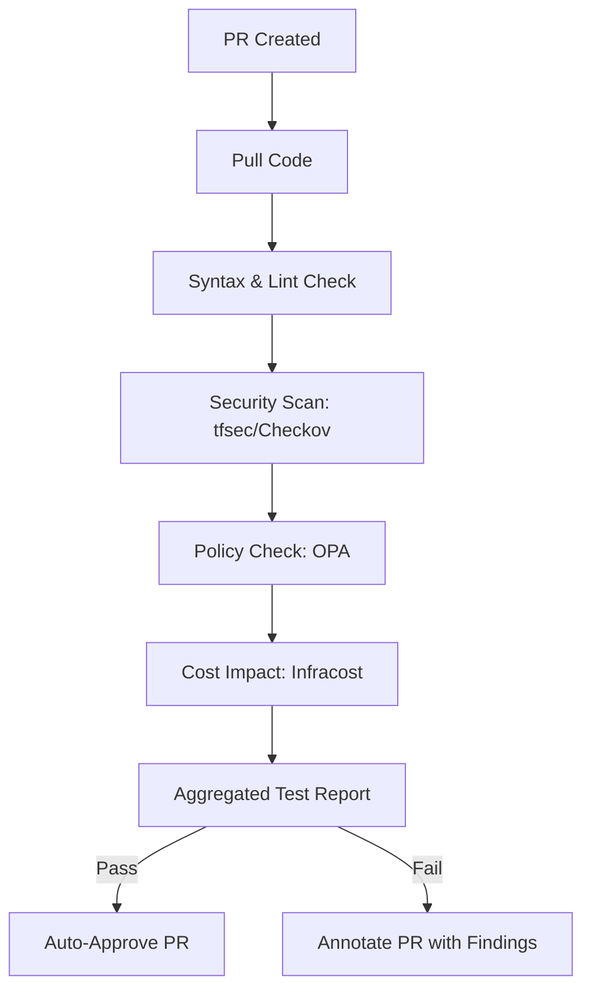
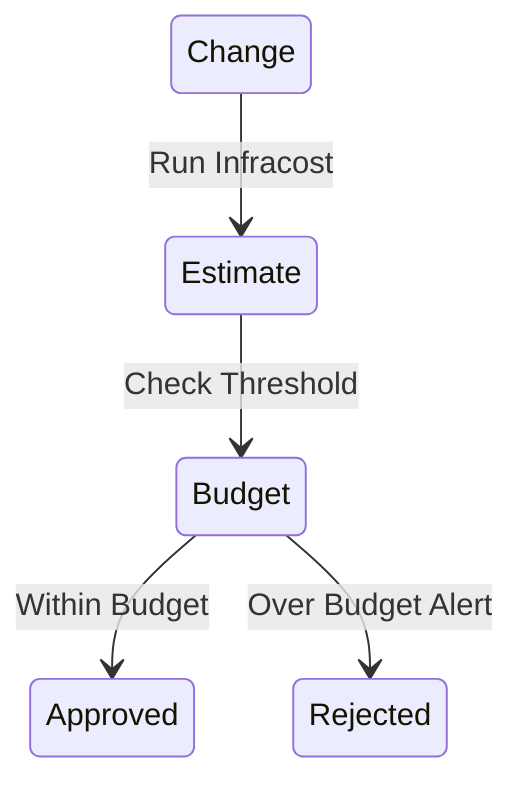

# Architecture & Validation Diagrams

## 11. Pre-Deployment Validation Workflow (Detailed)
*How the engine orchestrates multiple scanners into a single pass/fail signal.*



## 13. Drift Detection State Comparison
```mermaid
graph LR
    Local[Local State File] <-> Remote[Live Cloud Reality]
    Remote --> Detect[Drift Analyzer]
    Detect -->|Missing Resource| Alert[Drift: Deleted Resource]
    Detect -->|Modified Property| Alert[Drift: Property Change]
```

## 20. Infracost Budget Enforcement

