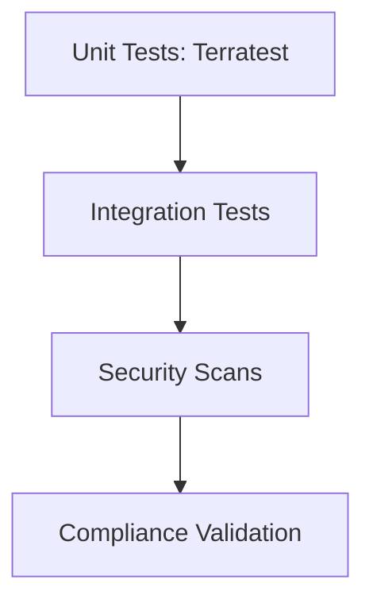

# Security & Compliance Diagrams

## 31. OPA Rego Policy Lifecycle


## 34. Infrastructure Security Testing Pyramid


## 40. Multi-Environment Parity Check
```mermaid
graph LR
    Dev[Dev Env] <-> Staging[Staging Env]
    Staging <-> Prod[Prod Env]
    Prod --> Diff[Identify Parity Gaps]
```
